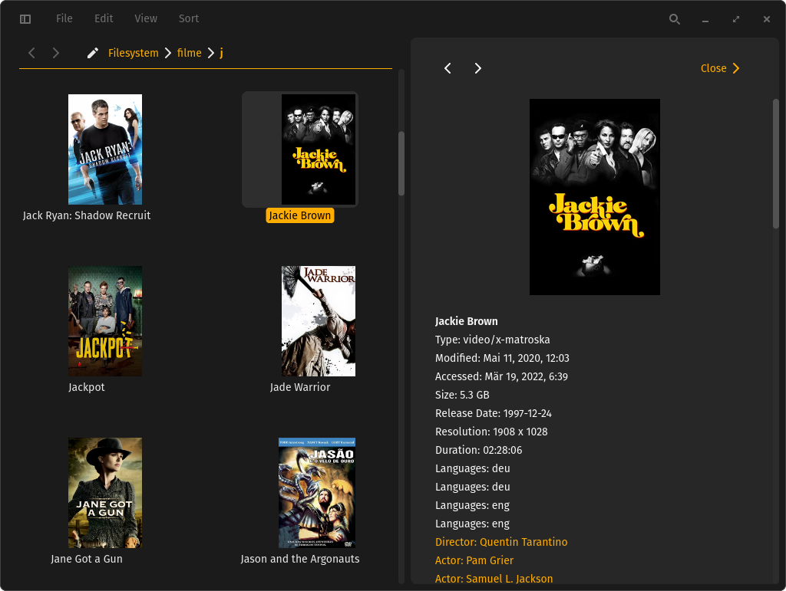
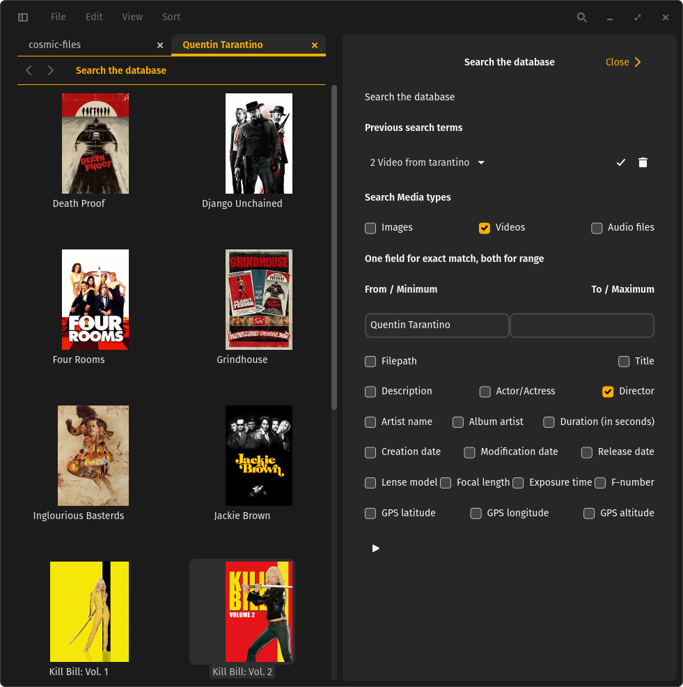
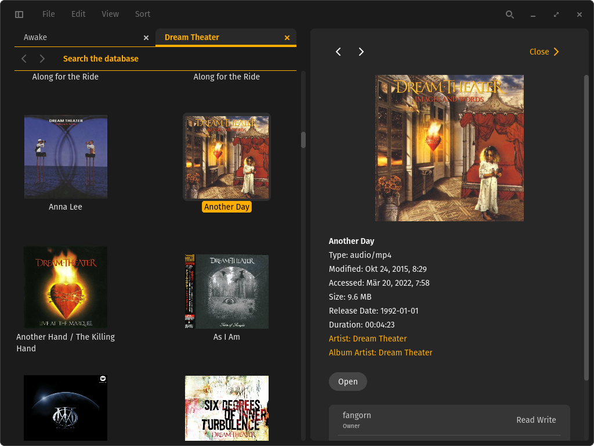
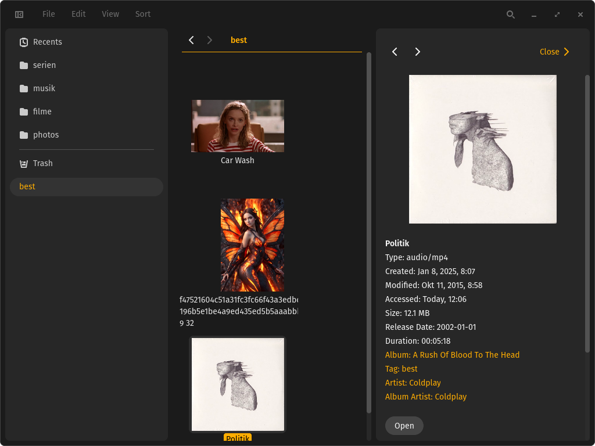
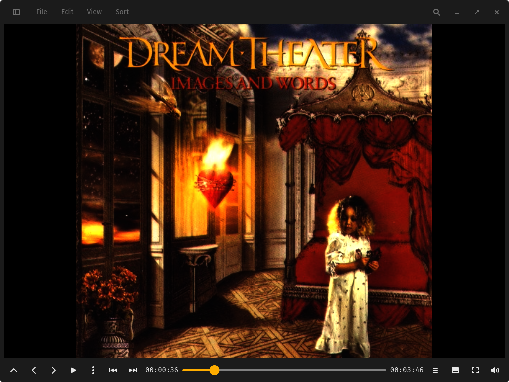
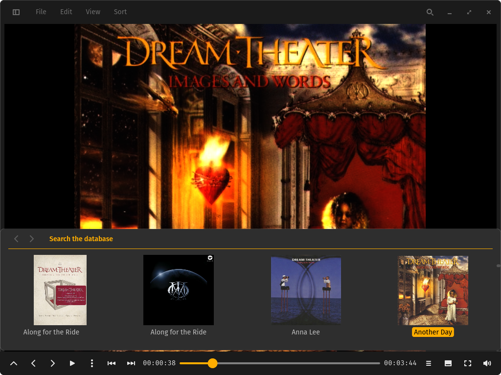

# media-browser

Media browser with database backend for the COSMIC desktop environment. It manages media, makes it searchable by internal or external metadata and displays / plays them.

Infuse (MacOS/IOS video player) was an inspiration. Wanted to write that program for Linux for a while. But if I had to write the metadata browsing and display engine anyway, why restrict the app to video content only? So we ended up with an Image viewer, video and audio player with a database backend.

EXIF metadata for images, NFO files for videos (XBMC/Kodi style) and ID3/MP4tag metadata for audio files are stored in a database and can be searched to produce a list of files matching, regardless where they are stored.

Search results and existing directories are navigatable with keyboard or picking files in preview.



Directory navigation displays media in the local directory. Detail information is available in the Preview. Some entries are directly searchable.



A search mask with all the options is also available. Previous searches are listed in the top and can be selected. The play button in the bottom starts the search.



Search results present the same view as the directory view. And they behave just the same.



In the upper left corner you can activate the navigation panel. As the name implies it can be used to navigate the filesystem / the tab that opens at startup. By default you get the most recently visited locations as well as default locations like your home, Documents, Music, Videos, and so on. You can change this layout by deleting entries and adding different ones. Bookmark the currently selected directory with Ctrl-D or by right-clicking and "Add to sidebar". You can open a bookmark by clicking in the standard tab or by right-clicking and "Open in new tab".

You can add tags to the navigation panel. Ctrl-T or File->Add Tag to sidebar will ask you to enter the name of the tag and will create it.

You can add media to a tag by selecting them in the in any of the open tabs and dragging them onto the tag.

Clicking on a tag will search for all media that you added to it. Right-clicking on it gives the option to open the media with this tag in a new tab.

In the details view you will get a list of all the tags you defined for a media. Clicking on the link will open a new tab with all the media you assigned this tag.

Right clicking on a tag gives you the option to remove the tag and all its entries from the database.



The player can navigate by chapters (if available) or seek by button or mouse-wheel. The mouse can also pick the scrubber and navigate that way. The home key will jump to the beginning.



The image viewer, video and audio player each provide a navigation strip to prewiew the other files besides the current one. Be it from a diretory or a search result. The file preview can be navigated by seleting via mouse or by Previous/Next buttons on the left or PageUp/PageDown Keys. If there are different media types selected, the viewer changes with the selected file.

This project is developed and tested on Linux using Wayland and Pipewire. Gstreamer supports any audio and video pipeline. But the GUI is libcosmic, which is a Wayland only framework. It should be possible to run this on any Linux/Wayland desktop. And also WSL2 on Windows 11. I just will not test it.

> [!NOTE]
> The current Status is feature complete for the 1.0 release. We are in beta mode for the release.

## Many thanks to the projects this software is based on

The file manager part is a clone of [COSMIC files](https://github.com/pop-os/cosmic-files) with a few modifications.

The GUI of the video / audio player is a clone of [COSMIC player](https://github.com/pop-os/cosmic-player). The player itself is a modification of [iced-video-player](https://github.com/jazzfool/iced_video_player).

The Image viewer GUI is inspired by [gthumb](https://gitlab.gnome.org/GNOME/gthumb). The viewer component is the image viewer provided by the [iced](https://github.com/iced-rs/iced) project.

The backend is a genuine creation.

## Required dependencies

Video and audio playback requires [GStreamer](https://gstreamer.freedesktop.org/).

Gstreamer is modular. Depending on what formats you want to playback (mp3, m4a, aiff, flac, mp4, mkv, wmv, av1, vp9, h264, hevc, ...) and what backend you want to use (pipewire, pulseaudio, alsa, jack, ...) specific gst-plugin-`format` have to be installed.

[Installing Gstreamer on Linux](https://gstreamer.freedesktop.org/documentation/installing/on-linux.html?gi-language=c)

Creation of video thumbnails and metadata extraction from video and audio require an installation of [ffmpeg](https://www.ffmpeg.org/) available to execute from the command line. Most linux distributions install that or at least have it available in the repositories. In some special cases it might be necessary to get ffmpeg from another source to support the media codecs in your media. But simple playback should be possible for a lot of codecs, which is good enough for what we need of it.

```sh
sudo apt install ffmpeg
```

You will need a rust environment to compile the project.

[Installing Rust](https://www.rust-lang.org/tools/install)

Installing build dependencies.

```sh
sudo apt install build-essential cmake libxkbcommon-dev
```

If you have problems to build on a system that does not have the COSMIC Desktop installed, it can help to install the dependencies for it.

```sh
sudo apt install just rustc libglvnd-dev libwayland-dev libseat-dev libxkbcommon-dev libinput-dev udev dbus libdbus-1-dev libsystemd-dev libpixman-1-dev libssl-dev libflatpak-dev libpulse-dev pop-launcher libexpat1-dev libfontconfig-dev libfreetype-dev mold cargo libgbm-dev libclang-dev libpipewire-0.3-dev libpam0g-dev -y
```

## Install media-browser

```sh
# Clone the project using `git`
git clone https://github.com/fangornsrealm/media-browser
# Change to the directory that was created by `git`
cd commander
# install
sudo just install
```

## Build the project from source

```sh
# Clone the project using `git`
git clone https://github.com/fangornsrealm/media-browser
# Change to the directory that was created by `git`
cd media-browser
# Build an optimized version using `cargo`, this may take a while
cargo build --release
# Run the optimized version using `cargo`
cargo run --release
```

## License

This project is licensed under [GPLv3](LICENSE)
Parts coming from external projects are specially marked
Usually they are licensed [MIT](http://opensource.org/licenses/MIT)
