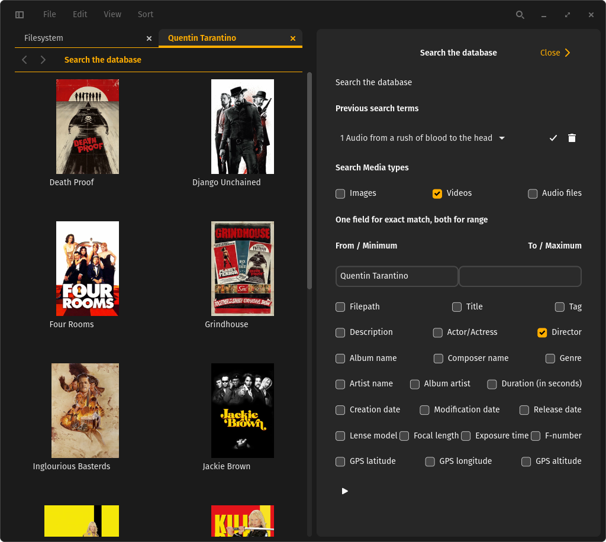

# media-browser

Media browser with database backend for the COSMIC desktop environment. It manages media, makes it searchable by internal or external metadata and displays / plays them.

Infuse (MacOS/IOS video player) was an inspiration. Wanted to write that program for Linux for a while. But if I had to write the metadata browsing and media display engine anyway, why restrict the app to video content only? So we ended up with an Image viewer, video and audio player with a database backend.

EXIF metadata for images, NFO file metadata for videos (XBMC/Kodi style) and ID3/MP4tag metadata for audio files are stored in a database and can be searched to produce a list of files matching, regardless where they are stored. Collections of videos are currently supported for the episodes of TV shows.

Search results and existing directories are navigatable with keyboard or picking files in preview.


Directory navigation displays media in the local directory. Detail information is available in the Preview. Some entries are directly searchable by clicking on the highlighted text. If you are currently watching the movie, the search result is opening in the background.

Opening a directory will scan all files in the directory to find supported media. The result is stored in a database. Once the contents are parsed into the database opening the directory is much faster. If you have a lot of media in a lot of directories manually going into each of them is tedious. So there is an option to scan all the contents of a directory.

If you navigate to a directory containing your media collection you can right-click *Scan All Subdirectories for media* or use *File->Scan All Subdirectories for*. This will find all the supported media in that directory and all directories in it.

> [!NOTE]
> While this is running the database is permanently written to. Any access will slow down the background process. And opening a directory - regardless if it is already in the database or if it has to be parsed and stored first - will open much slower than usual.

Depending on how many directories there are to scan and the number of media this can take a long time. You can monitor the progress as it is logged to the system. When the process is done, it will say so in the log.

```Shell
journalctl -f  /usr/bin/media-browser
```



A search mask with all the options is also available. Right-click into a tab and use `Search the Database` from the context-menu or use `File -> Search the Database` from the menu to start the search mask.

Previous searches are listed in the top and can be selected. Pick one from the drop-down box. The Check button applies the values. The trash button deletes this search from the list.

You can search for exact values or ranges (where it makes sense). Exact values work in either of the entry boxes. You have to pick what type of metadata you want to search for.

If the type is specific for one type of media, this type will automatically be selected. For example `Director` will activate `Videos`, `Album name` will activate `Audio`. If there is no selection active in `Search Media types`, the search will not work. So make sure to have the desired media type selected.

The play button in the bottom starts the search. The result will open as a new tab.


Search results present the same view as the directory view. And they behave just the same. If you can do something on a list of files in a directory, you can also do it on a list of media from the database.


In the upper left corner you can activate the navigation panel. As the name implies it can be used to navigate the filesystem / the tab that opens at startup. By default you get the most recently visited locations as well as default locations like your home, Documents, Music, Videos, and so on.

You can change this layout by deleting entries and adding different ones.

Right-click on an entry to get the option to delete it.

Bookmark the currently selected directory by pressing `Ctrl-D` or by right-clicking and selecting `Add to sidebar` from the context-menu or `File -> Add to sidebar` from the menu. You can open a bookmark by clicking onto the bookmark or by right-clicking it and selecting `Open in new tab` from the context-menu.

Your list of automatically available entries will vary, depending on what your machine has available in storage.


Directories are not the most flexible solution to order your data. Also the official metadata will help to find every movie in your collection that Quentin Tarantino directed. But only you can decide how to order media and where you will find them again in the selection and order you like.

You can add tags to the navigation panel. `Ctrl-T` or `File -> Add Tag to sidebar` will ask you to enter the name of the tag and will create it.

You can add media to a tag by selecting them in the in any of the open tabs and dragging them onto the tag.

Clicking on a tag will search for all media that you added to it. Right-clicking on it gives the option to open the media with this tag in a new tab.

In the details view you will get a list of all the tags you defined for a media. Clicking on the link will open a new tab with all the media you assigned this tag.

Right-clicking on a tag gives you the option to remove the tag and all its entries from the database. This does **not** delete the media files.

MediaBrowser is intended for viewing and searching media. If you need to add or delete media use a file manager or the command line. Deleted files will disappear from the database next time the directory is opened.

You could select media and *File->Move to Trash*. But this will currently only delete the media file. Not it's external metadata, the thumbnails or database entries.


The player can navigate by chapters (if available) or seek by button or mouse-wheel. The mouse can also pick the scrubber and navigate that way. The home key will jump to the beginning.


The image viewer, video and audio player each provide a navigation strip to prewiew the other files besides the current one. Be it from a diretory or a search result. The file preview can be navigated by seleting via mouse or by Previous/Next buttons on the left or PageUp/PageDown Keys. If there are different media types selected, the viewer changes with the selected file.

This project is developed and tested on Linux using Wayland and Pipewire. Gstreamer supports any audio and video pipeline. But the GUI is based on libcosmic, which needs to be installed to make the UI work properly. If compiled with `winit` feature, it will run on both X11 and Wayland.

> [!NOTE]
> The current Status is feature complete for the 1.0 release. We are in beta mode for the release.

## Many thanks to the projects this software is based on

Thanks to Firecore not making [Infuse](https://firecore.com/infuse) available on Linux I was motivated to start this project. It is a tool I use all the time on iPad, iPhone and AppleTV. It makes Video you own and host somewhere a working concept in the Apple Ecosystem. They are developing this for a long time. MediaBrowser will never approach feature parity with Infuse. But over time, who knows what will be useful enough to implement.

The file manager part is a modification of [COSMIC files](https://github.com/pop-os/cosmic-files).

The GUI of the video / audio player is a clone of [COSMIC player](https://github.com/pop-os/cosmic-player) with a few extra features. The player itself is a modification of [iced-video-player](https://github.com/jazzfool/iced_video_player).

The Image viewer GUI is inspired by [gthumb](https://gitlab.gnome.org/GNOME/gthumb). We ripped off their navigation strip and generalized it for all media types. The viewer component is the image viewer provided by the [iced](https://github.com/iced-rs/iced) project.

## Required dependencies

The DEB and RPM packages built below should automatically pull in all dependencies when installing it.

Video and audio playback requires [GStreamer](https://gstreamer.freedesktop.org/).

Gstreamer is modular. Depending on what formats you want to playback (mp3, m4a, aiff, flac, mp4, mkv, wmv, av1, vp9, h264, hevc, ...) and what backend you want to use (pipewire, pulseaudio, alsa, jack, ...) specific gst-plugin-`format` have to be installed.

[Installing Gstreamer on Linux](https://gstreamer.freedesktop.org/documentation/installing/on-linux.html?gi-language=c)

Creation of video thumbnails and metadata extraction from video and audio require an installation of [ffmpeg](https://www.ffmpeg.org/) available to execute from the command line. Most linux distributions install that or at least have it available in the repositories. In some special cases it might be necessary to get ffmpeg from another source to support the media codecs in your media. But simple playback should be possible for a lot of codecs, which is good enough for what we need of it.

```sh
sudo apt install ffmpeg
```

You will need a rust environment to compile the project.

[Installing Rust](https://www.rust-lang.org/tools/install)

Installing build dependencies.

```sh
sudo apt install build-essential cmake libxkbcommon-dev
```

If you have problems to build on a system that does not have the COSMIC Desktop installed, it can help to install the dependencies for it.

```sh
sudo apt install just rustc libglvnd-dev libwayland-dev libseat-dev libxkbcommon-dev libinput-dev udev dbus libdbus-1-dev libsystemd-dev libpixman-1-dev libssl-dev libflatpak-dev libpulse-dev pop-launcher libexpat1-dev libfontconfig-dev libfreetype-dev mold cargo libgbm-dev libclang-dev libpipewire-0.3-dev libpam0g-dev -y
```

## Install media-browser

```sh
# Clone the project using `git`
git clone https://github.com/fangornsrealm/media-browser
# Change to the directory that was created by `git`
cd media-browser
# Build an optimized version using `cargo`, this may take a while
just build-release
# install
sudo just install
```

## Packaging media-browser

```sh
# Clone the project using `git`
git clone https://github.com/fangornsrealm/media-browser
# Change to the directory that was created by `git`
cd media-browser
# Build an optimized version using `cargo`, this may take a while
just build-release
# build Debian / Ubuntu package
just build-deb

# build Redhat / Fedora / Suse package 
just build-rpm
```


## Build the project from source

```sh
# Clone the project using `git`
git clone https://github.com/fangornsrealm/media-browser
# Change to the directory that was created by `git`
cd media-browser
# Build an optimized version using `cargo`, this may take a while
cargo build --release
# Run the optimized version using `cargo`
cargo run --release
```

## License

This project is licensed under [GPLv3](LICENSE)

Parts coming from external projects are specially marked
Usually they are licensed [MIT](http://opensource.org/licenses/MIT)
